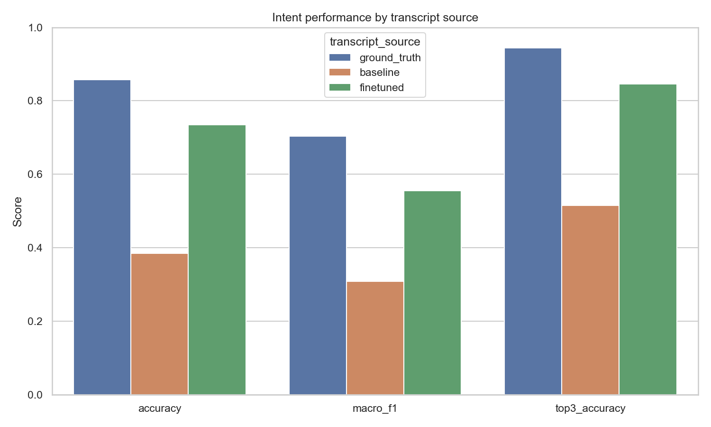
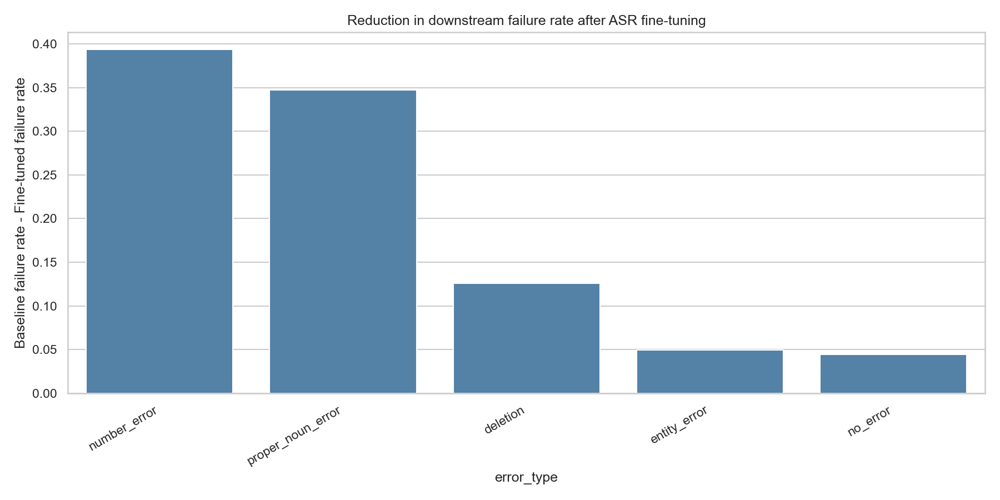

# VoxIntel-R

## One-line summary

VoxIntel-R studies reference-free reliability estimation for ASR-to-intent systems. The project asks whether a voice system can estimate when its ASR-derived intent is likely to fail using only inference-time signals, and then decide whether to execute, clarify, or abstain.

## Abstract

Spoken-language-understanding assistants run a two-stage cascade — automatic speech
recognition (ASR) followed by intent classification — in which ASR errors silently
propagate into wrong intents. VoxIntel-R asks whether such a system can estimate, **at
inference time and without any reference transcript**, when its own ASR-derived intent
is likely to be wrong, and use that calibrated risk to execute, clarify, or abstain. On
SLURP we find that the intent classifier's *own* predictive uncertainty over the ASR
hypothesis (confidence, entropy, margin) predicts downstream intent failure with
**ROC-AUC 0.912 on a frozen held-out split**, and that adding nine ASR-native
uncertainty features does **not** improve on it (paired-bootstrap ΔAUC = −0.037, 95% CI
[−0.051, −0.025]; 0/20 repeated splits favour the combined model). The reference-free
risk score is well-calibrated (ECE 0.019) and yields a better risk-coverage trade-off
than ASR- or intent-confidence thresholding (AURC 0.059 vs 0.083 vs 0.187). The negative
result replicates in direction on a second corpus (Fluent Speech Commands). We release
the full pipeline, a two-stage leakage audit, and a deployable reliability endpoint.

> **Status (2026-09-23): research state frozen.** The 22-notebook pipeline (phases 1–8)
> is complete and will not be extended. Of the two confirmatory experiments specified in
> [`reports/PAPER_APPENDICES.md`](reports/PAPER_APPENDICES.md), **Appendix A (N-best /
> decoder features for H1) has since been run** on its LM-free subset — H1 stays NOT
> SUPPORTED (B∪A′ AUC 0.890 < intent-only 0.912, ΔAUC −0.022, 0/20 splits); only the
> KenLM LM features and real severity labels for H4 remain, neither of which adds a
> notebook. See [Future Work](#future-work).

## Contributions

1. **A strict reference-free formulation** of ASR→intent failure prediction with a
   two-stage leakage audit that separates inference-time signals (ASR/intent
   uncertainty) from reference-derived ones (WER/CER/taxonomy).
2. **A clean negative result:** ASR-native uncertainty adds no measurable value over
   intent-native uncertainty — confirmed on a frozen SLURP split (bootstrap CI entirely
   negative, 0/20 repeated splits favour combined) and replicated in direction on FSC.
3. **A calibrated, deployable reliability score** that improves selective prediction
   (risk-coverage / AURC) over naive confidence thresholds, exposed through a working
   inference endpoint (`src/serving/app.py`, `/reliability`).
4. **A reproducible, phase-organized artifact trail** (notebooks 01–22 + `reports/INDEX.md`)
   from dataset audit through cross-dataset validation, including a documented and
   corrected taxonomy-pipeline bug (kept as a transparency asset).

## Key Results (SLURP, frozen 70/30 held-out split, n_test = 2,607)

| Reference-free feature set | ROC-AUC | PR-AUC | Brier |
|---|---:|---:|---:|
| ASR-confidence only (9 feat) | 0.615 | 0.311 | 0.165 |
| **Intent-confidence only (3 feat)** | **0.912** | 0.789 | 0.087 |
| Combined VoxIntel-R (12 feat) | 0.875 | 0.688 | 0.105 |

H1 (ASR adds beyond intent): **NOT SUPPORTED** — ΔAUC(C−B) = −0.037, 95% CI
[−0.051, −0.025]. Calibration ECE 0.019; selective-prediction AURC 0.059 (risk) <
0.083 (intent) < 0.187 (ASR) < 0.213 (always-execute). Reproduce with
`python src/analysis/frozen_split_eval.py` (see `reports/phase6_voxintel_r_slurp/FROZEN_SPLIT_RESULTS.md`).

## Research Question

> Can a voice system predict when its ASR-derived intent is likely to fail using only information available at inference time, and use that calibrated risk to selectively execute or clarify the command?

## Why VoxIntel-R?

The repository already contains a substantial historical research foundation in Notebooks 01–15. That work remains important, but it is now treated as the evidence base and motivation for the current VoxIntel-R direction rather than as the final novelty claim.

The progression is:

    VoxIntel v1
      Descriptive / diagnostic
        ↓
      Which ASR errors cause downstream failure?
        ↓
      Notebook 15
        Predictive but reference-aware
        ↓
      Can semantic error features predict failure?
        ↓
    VoxIntel-R
      Reference-free / operational
        ↓
      Can the system estimate when it should not trust itself?

Notebook 15 is an important bridge: it demonstrates meaningful predictive signal from post-hoc semantic and taxonomy-derived features, but those features are reference-aware and not deployable as real-time risk inputs. Notebook 16 is designed to solve that reference-dependence problem.

## VoxIntel-R Architecture

    flowchart LR
        A[Audio] --> B[ASR]
        B --> C[ASR hypothesis]
        B --> E[ASR-native uncertainty]
        C --> D[Intent model]
        D --> F[Intent uncertainty]
        E --> G[Reference-free risk model]
        F --> G
        C --> G
        G --> H[Calibrated risk]
        H --> I{Selective decision}
        I --> J[EXECUTE]
        I --> K[CLARIFY]

Reference transcripts are used only for training labels and evaluation. They are not part of the inference-time risk feature path.

## Reference-Free Design

Reference-free means the ground-truth/reference transcript is never used to construct inference-time features. The ASR hypothesis/transcript itself is allowed.

| Feature | Reference transcript required? | Available at inference? |
|---|---:|---:|
| ASR confidence | No | Yes |
| token/frame confidence | No | Yes |
| ASR entropy / uncertainty | No | Yes |
| duration / silence statistics | No | Yes |
| intent confidence | No | Yes |
| intent entropy | No | Yes |
| intent margin | No | Yes |
| WER | Yes | No |
| CER | Yes | No |
| reference-derived taxonomy | Yes | No |
| N-best disagreement | No | Stretch |
| LM / decoder scores | No | Stretch |

This table is intended to make the anti-leakage design auditable.

## Research Questions

### RQ1 — Error propagation foundation
How does ASR degradation propagate into downstream intent understanding?

### RQ2 — Reference-free risk prediction
Can inference-time ASR and intent uncertainty signals predict downstream intent failure without access to the reference transcript?

### RQ3 — Calibration and selective prediction
Can predicted intent-failure probabilities be calibrated well enough to support selective execution or clarification?

### RQ4 — Risk-coverage tradeoff
Can VoxIntel-R achieve a better risk-coverage tradeoff than simple ASR-confidence or intent-confidence thresholds?

### RQ5 — Cost-sensitive decision making
Under explicitly simulated or assigned severity tiers for SLURP intents, can severity-aware selective prediction reduce expected decision cost compared with uniform confidence thresholds?

## Hypotheses

1. Downstream intent failures are not random; many are predictable from inference-time uncertainty patterns.
2. Reference-free ASR and intent signals contain useful signal for downstream failure-risk estimation.
3. A calibrated reliability model can outperform naive thresholding based on ASR confidence or intent confidence alone.
4. Selective prediction can improve decision quality by trading coverage for reliability.
5. Cost-sensitive decision policies can reflect different operational assumptions without changing the underlying risk model.

## Research Foundation: Notebooks 01–15

The existing notebooks form the empirical foundation for the current VoxIntel-R objective. They are not discarded; they are treated as the historical basis that motivates the current reliability problem.

### 01–06: dataset audit, ASR baseline, and ASR fine-tuning
These notebooks cover dataset validation, audio quality checks, baseline ASR evaluation, and the SLURP ASR fine-tuning investigation. They establish the ASR conditions used to evaluate downstream intent robustness.

### 07–08: downstream intent modeling and ASR→intent propagation
These notebooks compare intent performance under clean transcripts, baseline ASR transcripts, and fine-tuned ASR transcripts. They quantify the empirical downstream effect of ASR quality.

Caption: ASR quality propagates into downstream intent understanding. On the SLURP validation set, replacing baseline ASR transcripts with fine-tuned ASR transcripts substantially recovered downstream intent performance.

The historical test-time comparison from Notebook 08 is:

- Ground truth: accuracy 0.8577, macro-F1 0.7032, top-3 0.9444
- Baseline ASR: accuracy 0.3849, macro-F1 0.3082, top-3 0.5157
- Fine-tuned ASR: accuracy 0.7343, macro-F1 0.5554, top-3 0.8454
- Recovery after fine-tuning: accuracy +0.3494, macro-F1 +0.2473

This is best interpreted as empirical downstream recovery associated with better ASR transcripts, not as causal proof of a universal ASR-quality effect.

### 09–13: error taxonomy, diagnosis, and validation
These notebooks developed the taxonomy and diagnostic machinery used to analyze semantic failure patterns. The taxonomy remains useful historical evidence, but its limitations are explicitly acknowledged in the project history.

Notebook 13 showed that the existing proper_noun_error category remained overly dominant:

- baseline fraction ≈ 87.17%
- fine-tuned fraction ≈ 74.67%

and the project explicitly concluded that further refinement was needed. The taxonomy should therefore be treated as a useful diagnostic layer, not as a final validated production taxonomy or required VoxIntel-R feature set.

### 14: high-impact semantic error analysis
This notebook reframed the problem from generic WER analysis toward semantic impact. It established that downstream failure reduction varied substantially across ASR error categories, and that WER alone is an insufficient proxy for semantic understanding risk.

Caption: Earlier post-hoc analysis showed that downstream failure reduction varied substantially across observed ASR error categories.

The historical category-level recovery evidence includes:

- number_error: baseline ≈ 0.682, fine-tuned ≈ 0.289, reduction ≈ 0.394
- proper_noun_error: baseline ≈ 0.645, fine-tuned ≈ 0.298, reduction ≈ 0.347
- deletion: baseline ≈ 0.211, fine-tuned ≈ 0.085, reduction ≈ 0.126
- entity_error: baseline ≈ 0.093, fine-tuned ≈ 0.043, reduction ≈ 0.050

This is historical semantic-impact evidence motivating the reliability problem; it is not the new VoxIntel-R contribution.

### 15: initial semantic error-risk prediction
Notebook 15 demonstrated that predictive signal exists when using post-hoc semantic and taxonomy-based features. This is an important bridge between diagnosis and the reference-free VoxIntel-R objective.

Observed results from the notebook include approximately:

- baseline intent failure: proxy-only logistic regression ROC-AUC ≈ 0.795
- baseline intent failure: combined logistic regression ROC-AUC ≈ 0.841
- baseline intent failure: cross-validation combined logistic ROC-AUC ≈ 0.842
- fine-tuned intent failure: proxy-only logistic regression ROC-AUC ≈ 0.707
- fine-tuned intent failure: taxonomy-only logistic regression ROC-AUC ≈ 0.824
- fine-tuned intent failure: combined logistic regression ROC-AUC ≈ 0.841
- fine-tuned intent failure: cross-validation combined logistic ROC-AUC ≈ 0.834
- paired bootstrap AUC improvement of combined vs proxy: baseline target ≈ +0.046, 95% CI ≈ [0.033, 0.060]
- paired bootstrap AUC improvement of combined vs proxy: fine-tuned target ≈ +0.134, 95% CI ≈ [0.109, 0.156]

These features were derived from reference-aware ASR/reference alignment and are therefore post-hoc. They are important because they establish predictive signal, but they do not yet solve the real-time reference-free problem. The point of VoxIntel-R is to move from reference-aware prediction toward a deployable inference-time reliability model.

## VoxIntel-R Experiments (Completed)

The VoxIntel-R phase spans notebooks 16–18 and has been executed end to end.
It grew one step beyond the original three-notebook plan: the calibration /
selective-prediction / cost-sensitive analysis (notebook 17's original goal)
was folded into an external **cross-dataset validation** on Fluent Speech
Commands (FSC) plus a final decision notebook (18). All headline numbers below
come from the saved artifacts under `reports/phase6_*` and `reports/phase7_*`.

### Notebook 16 — Reference-Free VoxIntel-R (SLURP)
Predict downstream intent failure using only inference-time ASR and intent
uncertainty signals. Reuses the frozen fine-tuned Wav2Vec2 checkpoint and the
DistilBERT intent model; nothing is retrained. Ground truth is used only to
build the target label (`predicted_intent != ground_truth_intent`), never as a
feature. A two-stage leakage audit is included and passes.

Comparison set (5-fold CV, 8,688 SLURP samples):

| Experiment | Features | Best ROC-AUC | PR-AUC | Brier |
|---|---:|---:|---:|---:|
| A — ASR-confidence only | 9 | 0.626 | 0.317 | 0.236 |
| B — intent-confidence only | 3 | **0.911** | 0.788 | 0.088 |
| C — combined VoxIntel-R | 12 | 0.883 | 0.707 | 0.103 |

**Key finding:** the intent-confidence-only model (B) is the strongest.
Adding ASR-native features (C) did **not** beat it. The top features are all
intent-native (`intent_margin`, `intent_confidence`, `intent_entropy`); every
ASR feature individually contributes ~0.04–0.06 importance.

> **Held-out confirmation (resolved).** These numbers originally came from 5-fold
> CV over the whole evaluation population. They have since been re-validated on a
> frozen stratified 70/30 held-out split (`python src/analysis/frozen_split_eval.py`):
> intent-only RF ROC-AUC **0.912** held, combined **0.875**, and the paired-bootstrap
> C−B gap is entirely negative (−0.037, 95% CI [−0.051, −0.025]; 0/20 repeated splits
> favour combined). The SLURP result is **no longer provisional**.

### Notebook 17 — Cross-Dataset Validation on FSC
External validation of the reference-free formulation on Fluent Speech
Commands, with independently trained Wav2Vec2 ASR + DistilBERT intent models.
FSC is split train → models, validation → risk-model fitting, test → frozen
evaluation.

`17_cross_dataset_transformer_voxintel_r_validation.ipynb` is the **executed**
cross-dataset study — it fine-tunes both models and produces the FSC results below.
(An earlier unexecuted scaffold, `17_..._validation2.ipynb`, was removed during the
freeze so a single canonical Notebook 17 remains.)

FSC frozen-test result, combined (C) vs intent-only (B), RandomForest:
ΔROC-AUC = **−0.025** (95% CI [−0.144, +0.093], not significant).

**H1 (ASR uncertainty adds signal beyond intent uncertainty): NOT SUPPORTED**
— the same direction as SLURP. Combined ROC-AUC 0.711 vs intent-only 0.735 on
the FSC test set.

### Notebook 18 — Final Reliability & Decision
Tests calibration (H2), selective prediction (H3), and cost-sensitive decisions
(H4) on **both** SLURP and FSC under each dataset's own artifact contract
(never pooled), then synthesizes across datasets. Only the lightweight tabular
risk layer is (re)fit; nothing upstream is retrained.

| Hypothesis | SLURP | FSC |
|---|---|---|
| H1 — ASR adds beyond intent uncertainty | NOT SUPPORTED | NOT SUPPORTED |
| H2 — calibration | **SUPPORTED** (ECE 0.019, Brier 0.103) | PARTIALLY (ECE 0.017, MCE 0.66) |
| H3 — selective prediction (AURC ↓) | **SUPPORTED** (risk 0.059 < intent 0.083 < asr 0.187 < always-execute 0.213) | PARTIALLY (beats always-execute; not intent-confidence) |
| H4 — cost-sensitive decisions | INCONCLUSIVE (no real severity labels) | INCONCLUSIVE (simulated severity) |

### Notebooks 19–22 — Hypothesis Validation Suite (Phase 8)

Notebooks 16–18 answered the four hypotheses once. A literature review then
surfaced four reviewer-level gaps (weak MSP-style baseline, shallow ASR signal,
no explicit cost model, no shift gate). Notebooks **19–22** close them in a
self-contained arc that runs entirely on cached features (no audio / GPU /
re-decode) and imports one shared, self-checked module,
`src/analysis/reliability_metrics.py`. Artifacts land in
`reports/phase8_hypothesis_validation/`.

- **19 — roadmap** (markdown only): states the four hypotheses and decision
  rules and what 20–22 deliver.
- **20 — H1, the strong version:** six **hyperparameter-tuned** classifiers
  (LogReg, RandomForest, HistGB, XGBoost, LightGBM, MLP) × three feature families,
  tuned with `RandomizedSearchCV` on the training split only and scored once on the
  frozen 30% test set with the full modern suite (ROC-AUC, PR-AUC, Brier,
  FPR@95%TPR, E-AURC, NCE). The best model is persisted to
  `models/voxintel_r_best_risk.joblib`.
- **21 — H2 + H3:** uncalibrated vs Platt vs isotonic vs temperature calibration;
  risk-coverage / AURC for model-risk vs MSP vs oracle vs random, with coverage at
  1 / 5 / 10 % risk budgets.
- **22 — H4 + shift + synthesis:** an explicit `c_FN:c_FP:c_review` cost model with
  a Bayes-optimal deferral rule and a severity-weight sweep (severities **simulated**
  — real labels are [Appendix B](reports/PAPER_APPENDICES.md)), SLURP→FSC transfer,
  a Mahalanobis support gate, and a final H1–H4 verdict table.

Phase-8 verdicts on the frozen SLURP test split (`nb2*_*.json` / `.csv`):

| Hypothesis | Verdict | Key number |
|---|---|---|
| H1 — ASR adds beyond intent | **NOT SUPPORTED** | tuned ΔAUC(C−B) = −0.017, 95% CI [−0.027, −0.007]; combined wins 0.1 % of bootstraps. Best A/B/C = 0.650 / **0.889** / 0.872 |
| H2 — calibration | **SUPPORTED** | isotonic ECE 0.014, MCE 0.098, Brier 0.115 → 0.097 |
| H3 — selective prediction | **SUPPORTED** | model AURC 0.058 < MSP 0.083; E-AURC 0.033 |
| H4 — cost-sensitive (simulated severity) | **SUPPORTED\*** | Bayes-rule cost 1,795 vs always-execute 5,113 vs confidence 3,397; per-sample gain CI [0.44, 0.80] at 73 % coverage. \*simulated, see Appendix B |

The tuned bake-off **strengthens** the H1 negative (it holds even after tuning the
combined model), and adds a genuine finding on shift: SLURP→FSC AUC drops
0.889 → 0.666, yet the Mahalanobis *density* gate flags ~9 % of in-domain
SLURP-test and only ~0.1 % of FSC — density gating alone does **not** catch this
concept shift, so a calibrated risk score must be paired with explicit output
monitoring.

## Results Summary

The central, honest result of the VoxIntel-R phase:

1. **Intent-model uncertainty already captures most of the downstream-failure
   signal.** A 3-feature intent-confidence model reaches ROC-AUC **0.912 on a frozen
   SLURP held-out split** (0.911 under 5-fold CV — the estimate is stable);
   ASR-native confidence alone is weak (~0.62).
2. **Reference-free ASR uncertainty does not add measurable value on top of
   intent uncertainty** (H1 not supported on both SLURP and FSC, same
   direction, FSC difference not statistically significant). This is a valid,
   reportable negative result, not a pipeline bug — the leakage audit passes.
3. **The reference-free risk score is well-calibrated and improves selective
   prediction over naive baselines** (H2/H3 supported on SLURP, partial on FSC
   where the test set has only 23 positive failures and confidence intervals
   are wide).
4. **Cost-sensitivity (H4) remains untestable as a hypothesis** for lack of real
   severity labels. SLURP now has a frozen risk-model split, but it carries no
   real action-severity labels, and the FSC severity tiers are simulated — so H4 is
   a sensitivity analysis, not a test (inconclusive on both).

Notebooks 19–22 (phase 8) subsequently re-ran H1–H4 as a hardened, reviewer-facing
confirmation on the frozen split — see the update note below, and the roadmap for
what would still move the result.

> **Update (phase 8).** Notebooks 19–22 were subsequently added as a
> hypothesis-validation suite: a tuned six-model bake-off that **strengthens** the
> H1 negative, plus calibration, selective-prediction, an explicit cost model, and
> a SLURP→FSC shift gate. See "Notebooks 19–22" above. H4 now has a full
> cost-sensitive analysis, but on **simulated** severities — real labels
> ([Appendix B](reports/PAPER_APPENDICES.md)) remain the only route to a true test.

## Evaluation

### ASR and transcript metrics
- Word Error Rate (WER)
- Character Error Rate (CER)
- validation / training loss
- inference latency

### Intent metrics
- accuracy
- precision
- recall
- macro F1
- confusion matrix

### Risk metrics
- ROC-AUC
- PR-AUC
- Brier score
- calibration error (ECE)
- reliability diagram
- risk-coverage curve

### Selective prediction metrics
- coverage
- clarification / abstention rate
- wrong-execution rate
- expected decision cost

## Dataset and Scope

The project remains grounded in the SLURP benchmark. Dataset statistics include:

- 141,649 total samples
- 101 intents
- 18 scenarios
- 54 actions
- average audio duration ≈ 2.59 sec
- median duration ≈ 2.37 sec
- 96.3% of samples under 5 sec
- severe class imbalance
- train_synthetic larger than real train

The scope is intentionally narrow and interpretable: the SLURP benchmark as the
primary dataset, **Fluent Speech Commands (FSC)** as an independent cross-dataset
check, one ASR pipeline family (Wav2Vec2 CTC), one intent model family
(DistilBERT), and a reference-free reliability study focused on inference-time
decision risk. FSC is a much easier, cleaner corpus (test WER ≈1.8%, intent
failure rate ≈0.6%), which is why its selective-prediction confidence intervals
are wide — a deliberate stress test of whether the SLURP findings generalize.

## SLURP Severity Limitation

SLURP is a smart-speaker / personal-assistant dataset. It does not contain banking transfers, medical decisions, or objectively labeled irreversible real-world actions. This limitation matters for the cost-sensitive layer.

The README therefore describes that layer as:

> simulated / assigned severity tiers over an existing public smart-speaker dataset

not as real-world ground-truth action severity.

## Research Contribution

Based on the work already completed in the repository, VoxIntel-R investigates a specific combination and evaluation setting at the ASR→intent handoff: reference-free failure prediction using inference-time uncertainty signals, followed by calibration, selective prediction, and cost-sensitive decision analysis.

This is not presented as a claim that confidence estimation, calibration, or selective prediction are new in general. Rather, the contribution is the application and evaluation of this combination in a speech-to-intent reliability setting under a strict anti-leakage constraint.

## Deferred / Stretch Research

The following are explicitly deferred rather than required milestones:

- human annotation and inter-annotator agreement
- taxonomy rebuild
- matched-WER perturbation study
- multilingual evaluation
- additional SLU datasets beyond SLURP + FSC
- N-best / LM feature infrastructure — LM-free N-best features **done** ([Appendix A](reports/PAPER_APPENDICES.md), H1 still not supported); only the KenLM LM features remain deferred

Note: **cross-dataset evaluation is no longer deferred** — it was completed in
notebook 17 on Fluent Speech Commands (FSC) and synthesized in notebook 18.

The taxonomy remains useful as a historical diagnostic layer, but it is not treated as a final validated production taxonomy and is not required in the VoxIntel-R MVP.

## Production / MLOps Roadmap

The research work is ahead of the production layer. Productionization remains a separate future phase rather than a current research milestone.

### Future Phase 7
- reusable training / inference scripts
- model registry
- FastAPI service ✅ (`/predict` + `/reliability`, reference-free risk scoring)
- Docker ✅ (`Dockerfile` + `.dockerignore` — lean reference-free reliability image)
- MLflow
- DVC
- tests ✅ (`tests/test_reliability.py` — reliability path + frozen-split invariants, dependency-free)
- CI/CD ✅ (`.github/workflows/tests.yml` — runs the tests on push/PR to `main`)
- monitoring

## Repository Structure

    VoxIntel/
    ├── data/                         # raw datasets (git-ignored)
    │   └── raw/
    │       ├── slurp/
    │       └── fsc/                  # Fluent Speech Commands (cross-dataset)
    ├── notebooks/                    # 01–22, the full research pipeline
    ├── configs/
    ├── src/
    │   ├── asr/                      # Wav2Vec2 loading + inference
    │   ├── analysis/                 # frozen-split validation + risk scoring
    │   ├── data/                     # SLURPDataset loader
    │   ├── evaluation/               # WER/CER helpers
    │   ├── intent/                   # DistilBERT intent helpers
    │   ├── optimization/             # quantization / latency (production stub)
    │   ├── serving/                  # FastAPI app + /reliability endpoint
    │   └── utils/                    # audio + text normalization
    ├── experiments/                  # early/superseded fine-tuning attempts (history)
    ├── reports/                      # organized phase-wise — see reports/INDEX.md
    │   ├── phase1_dataset_audit/
    │   ├── phase2_asr/
    │   ├── phase3_intent_propagation/
    │   ├── phase4_taxonomy/
    │   ├── phase5_semantic_risk/
    │   ├── phase6_voxintel_r_slurp/
    │   ├── phase7_reliability_cross_dataset/
    │   ├── phase8_hypothesis_validation/   # NB 19–22: tuned H1 bake-off, H2/H3, H4+shift
    │   ├── PAPER_APPENDICES.md
    │   ├── voxintel_research_audit.md
    │   └── INDEX.md
    ├── models/                       # trained checkpoints (git-ignored)
    ├── artifacts/                    # label mappings (id2label / label2id)
    ├── tests/                        # test_reliability.py (dependency-free)
    ├── Dockerfile                    # lean reference-free reliability service
    ├── .dockerignore
    ├── requirements.txt
    ├── README.md
    └── .gitignore

> Reports are grouped into phase folders that mirror the notebooks. The
> notebooks originally wrote to a flat `reports/` directory, so a re-run will
> recreate a file at the old flat path; move it into the matching phase folder
> afterwards. See `reports/INDEX.md` for a full artifact catalog.

## Installation

    git clone https://github.com/praxshant/VoxIntel.git
    cd VoxIntel
    pip install -r requirements.txt

## Future Work

The VoxIntel-R phase produced a clear, honest result (intent-native uncertainty
dominates; ASR-native uncertainty adds little), now confirmed on a frozen SLURP
held-out split.

**Done in the latest iteration**

- ✅ **Frozen SLURP held-out split** (`src/analysis/frozen_split_eval.py`) — promotes
  the SLURP H1 result from provisional (5-fold CV) to a confirmed negative on a
  never-touched test set, with a paired-bootstrap CI and a 20-split stability check.
- ✅ **Deployable reliability endpoint** — the validated intent-confidence risk model
  is persisted and served at `POST /reliability` (`src/serving/app.py`), returning a
  calibrated risk score and an execute/defer decision from inference-time signals only.

**Recommended next steps, in priority order**

1. **Real severity labels for H4.** Cost-sensitive selective prediction cannot be
   tested as a hypothesis on SLURP (smart-speaker intents, no action severity) or FSC
   (simulated tiers). A small human-annotated severity schema over SLURP intents — or a
   dataset with genuine action risk — turns H4 from a sensitivity analysis into a test.
   The annotation schema, reliability plan, and cost-matrix test are specified in
   [Appendix B](reports/PAPER_APPENDICES.md).
2. **N-best / decoder-LM feature family — LM-free subset now run (H1 confirmed).**
   [`src/analysis/appendix_a_nbest.py`](src/analysis/appendix_a_nbest.py) did a
   GPU beam-search decode (`pyctcdecode`, beam 100, N-best 10, no LM) over all
   8,688 SLURP-dev clips and computed 4 reference-free N-best features. On the
   frozen split B∪A′ *underperforms* intent-only B (AUC 0.890 vs 0.912, ΔAUC
   −0.022, 95% CI [−0.033, −0.010], 0/20 splits) — H1 NOT SUPPORTED with
   beam-search evidence, not just frame-level CTC. **Remaining:** the 2 KenLM LM
   features (LM score, acoustic−LM disagreement); no Windows KenLM wheel, so a
   C++ build is the one open step. Decode config, features, and the
   flip-the-conclusion decision rule are in [Appendix A](reports/PAPER_APPENDICES.md).
3. **Second ASR/NLU pair and a noise-robustness sweep** to show the negative result is
   not specific to Wav2Vec2+DistilBERT — the largest external-review concern.
4. **Finish productionization** — model registry, MLflow/DVC and monitoring around the
   now-wired FastAPI service (Docker, tests, and CI are done).

## Reproducibility

Headline SLURP results reproduce **without audio or GPU** from the cached
inference-time features:

    python src/analysis/frozen_split_eval.py     # frozen-split H1 + persisted risk model
    python src/serving/app.py                     # reliability-scoring self-check
    python src/analysis/reliability_metrics.py    # phase-8 metrics module self-check

The **phase-8 notebooks (19–22)** also run entirely on the cached feature CSVs
(no audio/GPU): execute 20 → 21 → 22 in order (20 persists the risk model the
others load). Both scripts above end in an `assert`-based self-check. The full
feature-extraction and model-training pipeline (notebooks 01–18) does require the
SLURP/FSC audio and the fine-tuned checkpoints, which are git-ignored; see
`reports/INDEX.md` for the artifact each notebook produces. Random seed is fixed
at 42 throughout.

## Project Goal

VoxIntel-R aims to determine whether a voice system can estimate the reliability of its own ASR-derived intent without access to a reference transcript, and then use that calibrated risk to selectively execute or clarify commands. The project connects ASR-native uncertainty, downstream intent-failure prediction, selective prediction, and cost-aware decision analysis under a single, auditable research design.
